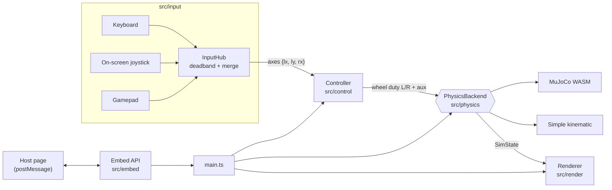

# yakrobot-simulator

Browser simulator for small 4WD skid-steer rovers: TT gear motors, Arduino Nano with two
DRV8833 drivers, and an ESP32-CAM. You drive the rover around a furnished room, watch
its onboard camera and dribble a football with a servo claw. Vite + TypeScript +
three.js, with MuJoCo (WASM) for physics. It builds to static files and has no backend.

The default robot is the **yakrobot-4wd**, our own open-frame design
([`robots/yakrobot-4wd/`](robots/yakrobot-4wd/README.md)).

## Run

```
npm ci
npm run cad -- yakrobot-4wd   # OpenSCAD -> robots/yakrobot-4wd/stl/ (needs openscad)
npm run model            # STLs -> public/models/<id>.glb
npm run dev              # http://localhost:5173
npm test                 # vitest
npm run build            # tsc --noEmit + static build to dist/
```

Without a GLB the sim still runs, with a box in place of the chassis.

## Architecture

Everything runs in the page. A fixed 50 Hz loop moves input through the same stages a real
rover's firmware would. The renderer draws whatever state the physics backend last
produced.



### Pieces

| Path | Role |
|---|---|
| `src/main.ts` | Wires everything together: page options, UI buttons, the fixed-step loop, robot and physics switching, host API |
| `src/sim/loop.ts` | `FixedStepLoop`: 50 Hz accumulator, at most 10 catch-up steps per frame |
| `src/input/` | Keyboard, pointer joystick and gamepad sources. `InputHub` applies the 0.15 deadband and lets the largest deflection win. `Actions` holds claw, headlights and night |
| `src/control/` | `robot.ts` validates `robot.json`. `controller.ts` is the pure skid-steer mixer (`left = v − w`, `right = v + w`) plus min-duty, per-side inversion and the input watchdog. Its output is what the Nano would send to the DRV8833s |
| `src/physics/backend.ts` | The `PhysicsBackend` interface (`step(duty, dt, aux)`, `state()`, `reset()`) and `SimState`, the only thing the renderer reads |
| `src/physics/mujoco.ts`, `mjcf.ts` | MuJoCo backend. `mjcf.ts` generates the MJCF from the robot profile and the room, and `mujoco.ts` loads the WASM on first use |
| `src/physics/simple.ts`, `src/sim/` | Simple backend: first-order motor lag, dead zone, diff-drive with a fixed turn-slip factor, circle-vs-box collision |
| `src/robots/` | Profile registry. Every `robots/<id>/` folder with `robot.json` and `assembly.json` becomes a profile. `assembly.ts` validates the assembly contract |
| `src/world/` | `room.ts`: the room (walls, furniture, loose objects), shared by both backends and the renderer. `claw.ts`: claw geometry from `assembly.json` |
| `src/render/` | three.js scene. `room.ts` draws the room, `rover.ts` draws the chassis GLB with procedural wheels, motors, LEDs and claw, and `onboard.ts` provides the ESP32-CAM camera |
| `src/embed/` | `options.ts` parses query params (embed mode, theme colours, parent origin). `api.ts` validates postMessage commands |
| `src/shims/` | Browser stand-in for Node's `module` builtin, which MuJoCo's loader imports (build only) |
| `scripts/` | Node build tools (run as `.ts` directly): `build-cad.ts` (OpenSCAD → STL) and `build-model.ts` (STL → low-poly flat-shaded GLB) |
| `config/reference.json` | Hand-worked mixer and watchdog test vectors |
| `tests/` | vitest: controller, input, loop, vehicle, physics (both backends), profiles, model, camera/lights, embed |

### Design rules

- **One room, three consumers.** The MuJoCo model, the simple model's obstacles and the
  three.js scene all read `src/world/room.ts`, so they can't drift apart.
- **The robot is data.** Every dimension, limit and physics constant comes from
  `robots/<id>/robot.json` and `assembly.json`. The code has no robot-specific numbers.
- **The renderer only reads.** It consumes `SimState` and never changes simulation
  state.
- **Backends are swappable live.** MuJoCo is the default. If it fails to load, the sim falls
  back to the simple model. The simple model treats loose objects as fixed.
- **Real-robot ready.** The controller emits per-side duty plus an `Aux` record (claw,
  headlights). A real-robot adapter would forward exactly that.

### Physics

- **MuJoCo:** the rover is a free body with four hinged wheels driven by DC-motor
  actuators (torque = stall × (duty − speed / no-load speed)). Speed, skid-steer turning,
  wheel slip and pushing objects all come from the contact solver. The WASM loads lazily
  (~2.6 MB gzipped).
- **Simple:** a kinematic model. `limits.turnRate_radps` sets its turn-slip factor.

Most physics values are tagged `provisional` in `robot.json` → `provenance` and need
replacing with measurements from a real rover.

### Onboard camera and lights

The inset is the ESP32-CAM view: an OV2640 with about 66° horizontal field of view at 4:3,
parented to the rover so it pitches and rolls with it. **F** swaps it with the world
view; the full-screen FPV view is letterboxed to 4:3. Both views share one WebGL canvas,
drawn with scissor viewports. The two front COB LEDs are spotlights, and **Night** dims the room.

### Claw

A low servo claw on the front, defined per robot in `assembly.json` → `claw`. It is a
simulator accessory, not part of the chassis design. It sits below the camera lens so
it stays out of shot. Drive onto the ball and press **C** to cage it, so it rolls with
the rover through turns.

## Robots

| Id | Robot | Model source |
|---|---|---|
| `yakrobot-4wd` (default) | Our own open-frame 4WD design ([details](robots/yakrobot-4wd/README.md)) | `robots/yakrobot-4wd/cad/yakrobot-4wd.scad` → `npm run cad -- yakrobot-4wd` |

A robot folder holds `robot.json` (drive, motors, physics) and `assembly.json` (parts,
axle, collision boxes, camera, LEDs, claw). Robots with OpenSCAD source also have a
`cad.json`. To add a robot, copy a folder and change the numbers. `tests/profiles.test.ts`
runs the same physics and fit checks on every robot.

### `robot.json`

| Field | Meaning |
|---|---|
| `wheelType` | `"monster"` (skid-steer, the only supported type) |
| `geometry.wheelbase_m`, `track_m` | Axle-to-axle and wheel-centre-to-wheel-centre distances |
| `geometry.wheelDiameter_m`, `wheelWidth_m` | Tyre size |
| `limits.topSpeed_mps` | Ground speed at full duty |
| `limits.turnRate_radps` | Full-stick spin rate (simple model's turn slip) |
| `drive.axisSigns` | `{lx, ly, rx}` sign per axis |
| `drive.invertLeft`, `invertRight` | Flip a side whose motor is wired backwards |
| `drive.minDuty` | Smallest non-zero duty, to clear the motor dead zone |
| `drive.watchdog_ms` | Stop if the newest input is older than this |
| `motor.timeConstant_s`, `deadZone`, `stallTorque_Nm` | Spin-up lag, dead zone, wheel torque at stall |
| `physics.mass_kg`, `wheelMass_kg`, `tyreFriction`, `armature_kgm2` | MuJoCo body parameters |
| `provenance` | Where each value came from |

## Controls

| Action | Keyboard | Touch | Gamepad (standard) |
|---|---|---|---|
| Forward / back | W/S, ↑/↓ | joystick | left stick Y |
| Turn | A/D, ←/→ | joystick | right stick X |
| Stop (latching) | Space | STOP | B / Circle |
| Claw grab / release | C | GRAB | A / Cross |
| Headlights | L | LIGHTS | X / Square |
| Day / night | N | Night | — |
| Swap world view / FPV | F | FPV view, or tap the inset | — |
| Show / hide camera | V | Hide camera | — |

## Embedding

A host page can frame the static build. See
[`public/embed-example.html`](public/embed-example.html).

```html
<iframe src="https://simulator.yakrobot.com/?embed=1&parent=https://yakrobot.com"
        allow="fullscreen; gamepad" style="border:0; width:100%; aspect-ratio:16/10"></iframe>
```

| Query param | Effect |
|---|---|
| `embed=1` | No debug HUD, compact controls, starts in the room view |
| `hud=1` | Show the debug HUD anyway |
| `parent=<origin>` | Only accept commands from, and only send state to, this origin |
| `robot=<id>` | Start with this robot |
| `accent`, `stop`, `panel`, `frame` | Theme colours, hex only (e.g. `%23ff6600`) |

**Host → sim:** `{ type: 'yakrobot-sim', cmd, value? }`. Boolean commands (`claw`, `lights`,
`night`, `fpv`, `stop`, `follow`, `camera`) toggle when `value` is left out. Other
commands are `physics` (`'mujoco'` | `'simple'`), `robot` (id), `reset` and `getState`.

**Sim → host:** `{ type: 'yakrobot-sim', event: 'ready' | 'state', state }`, sent on load
and on every change. `state` has `clawClosed, lights, night, fpv, stopped, follow, camera,
physics, robot`.

The sim only listens to the page that frames it, and only to `parent` when that is set.

## Status

- [x] Input, controller, simple vehicle model, 50 Hz loop
- [x] MuJoCo backend, room scene, claw
- [x] Robot profiles, yakrobot-4wd in OpenSCAD
- [x] Onboard camera, headlights, day/night
- [x] Embed API
- [ ] Deploy to simulator.yakrobot.com
- [ ] Real-robot adapter (forward duty + `Aux` to hardware)

Mecanum wheels were dropped as too hard to model well.

## Licence

Apache License 2.0, see [LICENSE](LICENSE).
